# Homework1

## 实验环境

Ubuntu 20.04 Server 64bit 以及阿里云平台提供的linux环境

## 调查并记录实验环境的如下信息：
### 当前 Linux 发行版基本信息

命令为:

 `lsb_release -a `

 虚拟机的发行版情况：

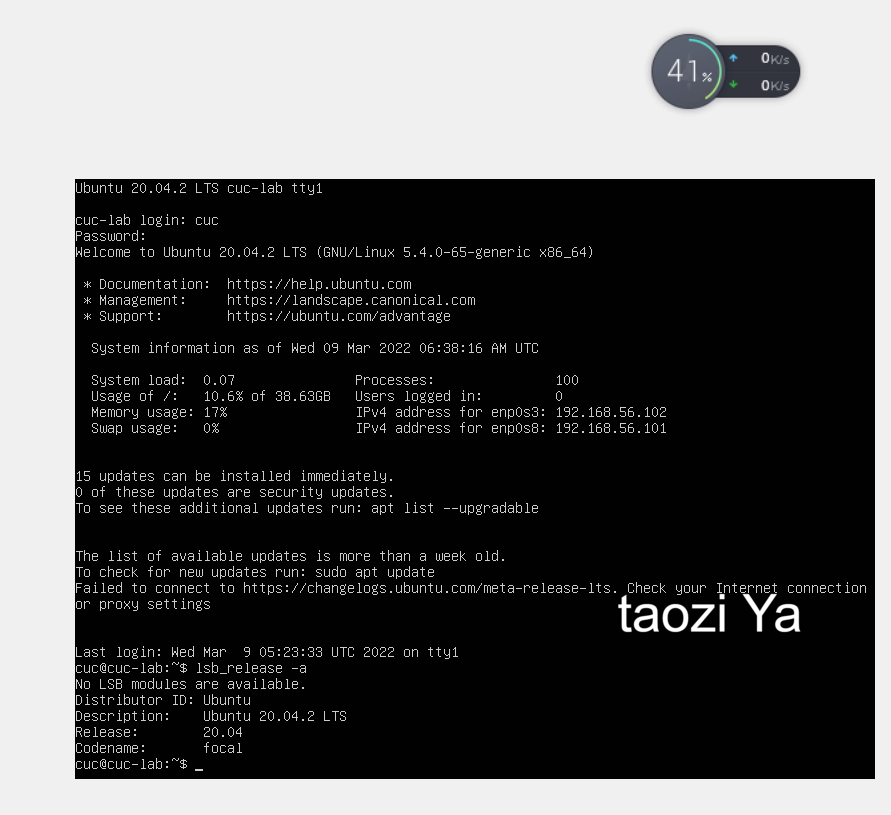

云端平台的发行版情况：

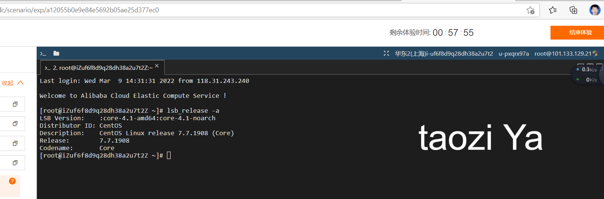

### 当前 Linux 内核版本信息

命令为：

`uname -r`

虚拟机的内核版本信息：

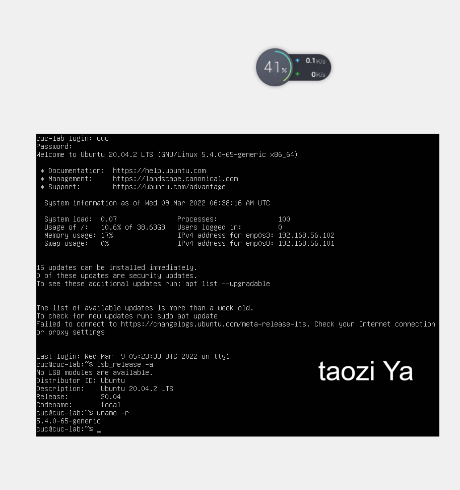

云端平台的内核版本信息：

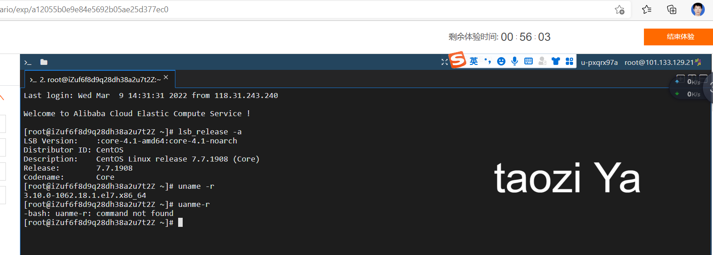

## Virtualbox 安装完 Ubuntu 之后新添加的网卡如何实现系统开机自动启用和自动获取 IP？

网卡1设置为`NAT`，新增的网卡3和网卡2保持一致，设置为`Host-only`网络。

查看网卡情况，根据提示执行

`sudo apt install net-tools`

再次使用`ifconfig `和`ifconfig -a`查看效果：

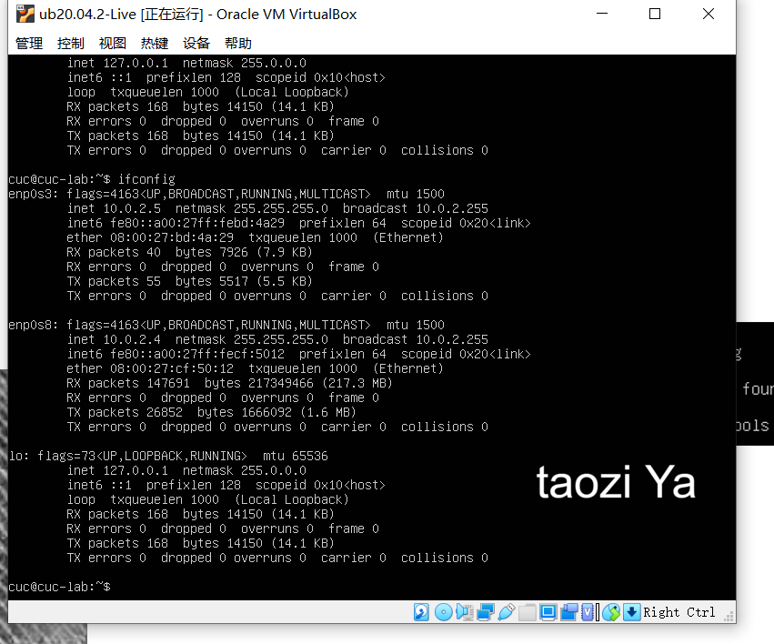

以及

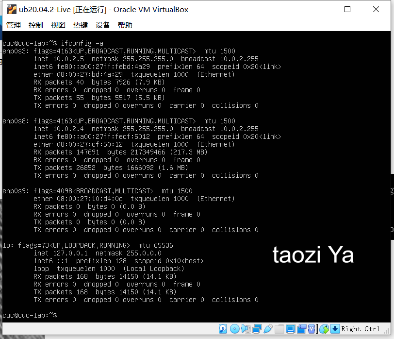

表明网卡3，也即 `enp0s9`,存在但是没有激活。

依次`cd`到相关目录后，找到相应的`yaml` 文件： 

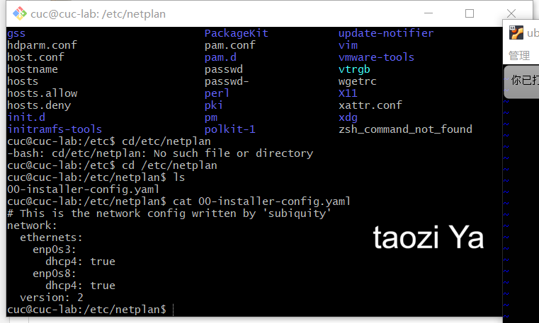

再使用 `sudo vim`指令对此文件进行修改，以此激活网卡3：

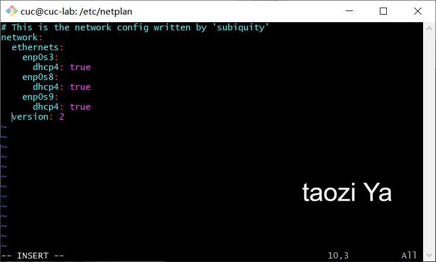

查看修改后的情况，可知网卡3已激活。

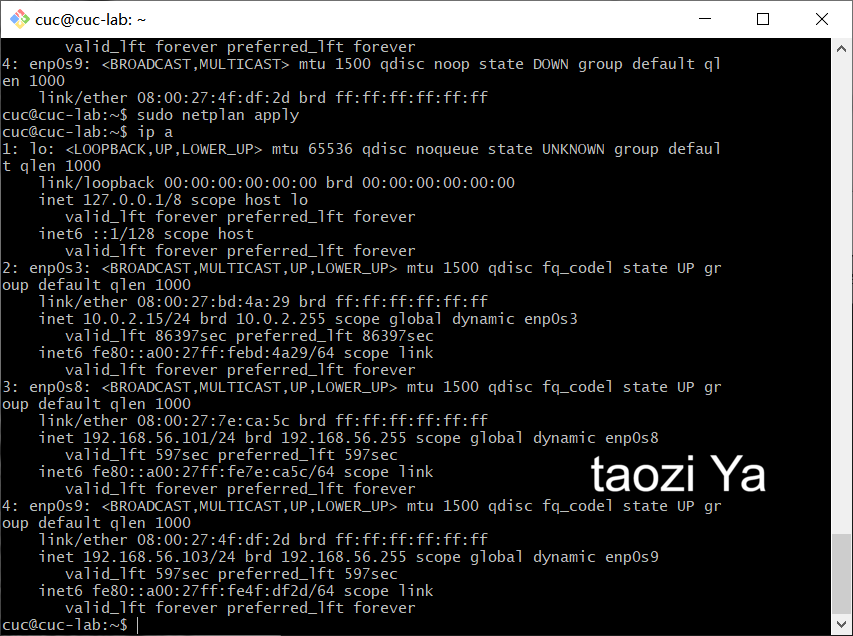

## 如何使用 scp 在「虚拟机和宿主机之间」、「本机和远程 Linux 系统之间」传输文件

### 虚拟机与宿主机

在宿主机设置一个测试文件 `test.txt`

首先是宿主机传输文件到虚拟机：

使用指令`scp C:/Users/HUAWEI/Desktop/test.txt cuc@192.168.56.101:~/`

在虚拟机上查看是否收到, `ls`之后发现此目录下存在`test.txt`文件，用 `cat`命令打开即可。

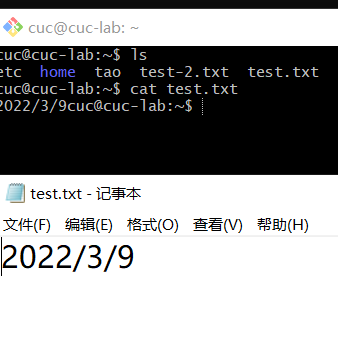

然后是虚拟机修改该文件后并传输文件到宿主机：

指令为：`scp cuc@192.168.56.101:/home/cuc/test.txt ./`

然后在宿主机查看是否收到：

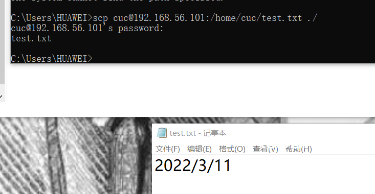

### 本地与云端 ###

首先是本地传输到云端

指令为 `scp C:/Users/HUAWEI/Desktop/test.txt root@101.133.128.31:root`

 ![本地传输] (img/本地传送-.png)

 再查看云端是否收到

 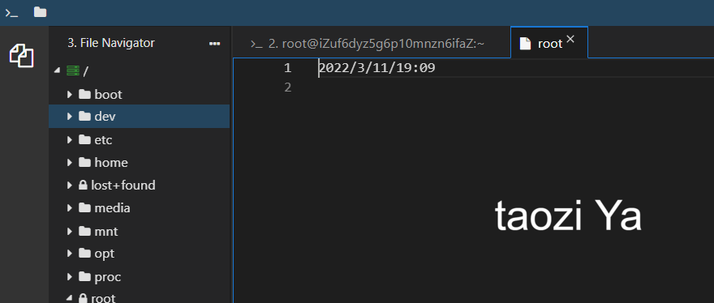

 再就是云端传输到本地

 指令为  `scp root@101.133.128.31:/root/root ./`

 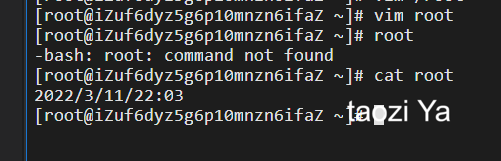

 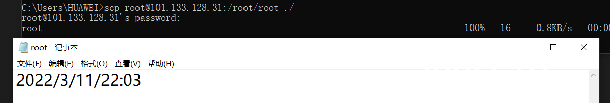

### 如何配置 SSH 免密登录？

使用指令 `ssh-keygen -t rsa`，来生成密钥

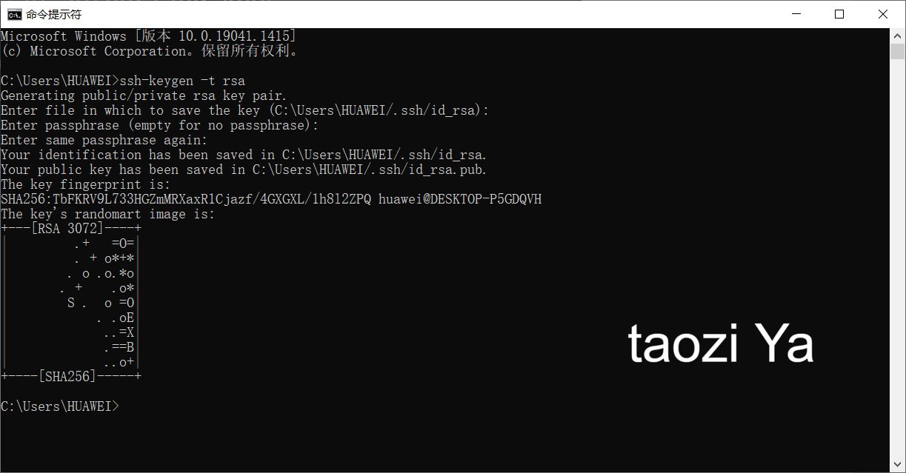

在终端中执行scp远程拷贝命令

`scp C:/Users/HUAWEI/.ssh/id_rsa.pub cuc@192.168.56.101:~/.ssh`

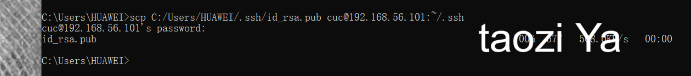

 再执行指令：`cp  id_rsa.pub  authorized_keys`,将公钥复制为authorized_keys文件

 查看结果，发现配置成功！

 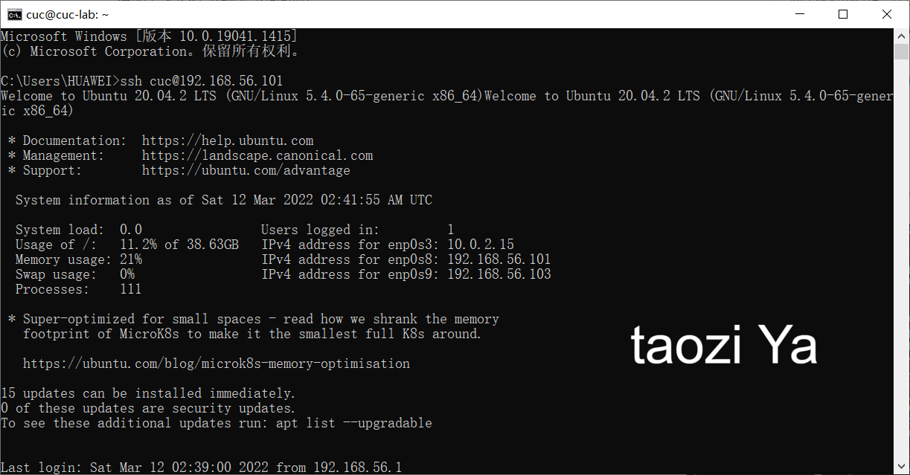

## 实验反思

1.实验过程中还是出现了不少的问题，很多就是那种瑕疵，比如空格多了或者少了，代码拼写错误等等，以及还有很多知识上的漏洞。

2.`ssh`确实好用，不用在黑色的虚拟机里面敲密码，复制粘贴真是程序员智慧的结晶。

3.畅课的讨论区很好，同学们分享问题，老师以及师哥师姐来解答。有效的反馈，有效的解决问题。有的时候发现出问题了，去讨论区逛一下也能发现解决方案。点赞。

4.我觉得还有些细节处理不好的地方，就是截图下一次可以只截取需要的那一个局部，不用把整个窗口都放上来。再者就是下次图片命名能更专业一些，不用中文了，虽然意思也很明确，但总感觉缺了点计算机专业的意思。

## 参考资料：
[ubuntu20添加新网卡后设置自动启用并获取ip](https://blog.csdn.net/xiongyangg/article/details/110206220)

[解决virtualbox虚拟机设置nat网络提示无效设置](https://jingyan.baidu.com/article/a3f121e4850c98fc9052bb97.html)

[设置ssh免密码登陆linux的配置步骤](https://www.jianshu.com/p/e9db116fef8c)
