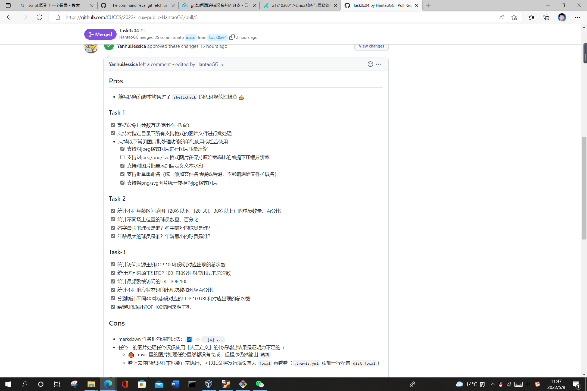

# 韩涛 2020212063013

首先很抱歉要写这个文档，因为种种误操作导致的作业后续查看出现了种种问题

作业是按时提交的，自己在本地检查的时候没有出现任何问题。

然后师姐昨天晚上，就是`2022/5/8`给出了作业的评价。

于是，今天早上我就想着去依照着修改一下问题。

首先是对勾的处理:

在`vscode`里面使用查找和替换功能，☑ 替换为 `- [x]` 即可。

之后就是解决图片没有修改成功的问题。

大概看了一下之后我就发现是我要用的测试图片并没有上传上去。根据本地的图片和脚本的相对位置，我也在相应位置上传了图片。这样可以验证就解决了。

但是上传之后不知道什么错误，一直说合并失败之类的，提示问题在`git`同目录下的`README.md`文件，然后我就一直修改找问题，不小心把`main`分支和`task0x04`合并了，以至于`PR`就关闭了。然后想着重新上传一个分支作业上去，显示`show no changes`。我这个时候就很糊涂了，然后去`travis-ci`看了一下，发现出问题了，翻译过来，就是自己的信用额度为负值，不能再构建了。

要购买的话，一个月要69美元，确实划不来。钱要花在刀刃上。

整体来说，就是作业本来就一个小部分出了问题，但是我外行人一顿捣鼓，反而坏了事。但是最终师姐提到的问题是解决掉了。如果老师或者师哥师姐还有兴趣了解实验代码的运行情况，应该可以直接在我的`github`仓库的分支`task0x04`中查看到修改后的代码。

写这篇文档的目的就是表明作业的确是按时按量写了，并且也有一颗及时修正错误的心。