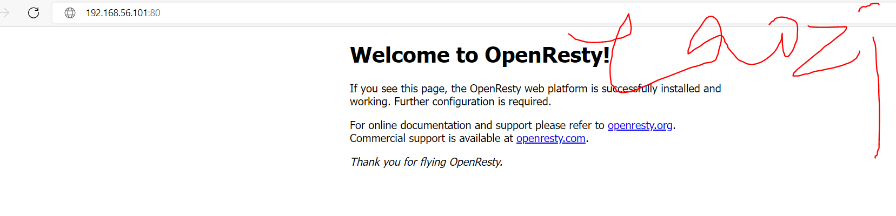
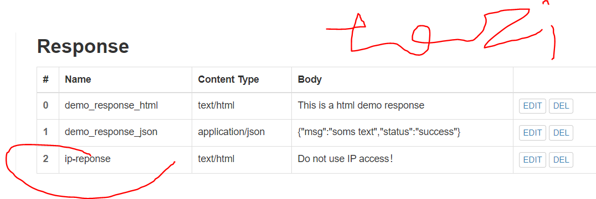

# 实验五 `web`服务器

## 实验环境

`Ubuntu 20.04`

`Nginx`

`VeryNginx`

`Wordcompress 4.7`

## 实验要求

### 基本要求

#### 在一台主机（虚拟机）上同时配置`Nginx`和`VeryNginx`

VeryNginx作为本次实验的`Web App`的反向代理服务器和`WAF`

PHP-FPM进程的反向代理配置在`nginx`服务器上，`VeryNginx`服务器不直接配置Web站点服务

使用Wordpress搭建的站点对外提供访问的地址为： `http://wp.sec.cuc.edu.cn`

使用`Damn Vulnerable Web Application (DVWA)`搭建的站点对外提供访问的地址为： `http://dvwa.sec.cuc.edu.cn`

### 安全加固要求

使用`IP`地址方式均无法访问上述任意站点，并向访客展示自定义的友好错误提示信息页面`-1`

`Damn Vulnerable Web Application (DVWA)`只允许白名单上的访客来源`IP`，其他来源的IP访问均向访客展示自定义的友好错误提示信息页面`-2`

在不升级`Wordpress`版本的情况下，通过定制`VeryNginx`的访问控制策略规则，热修复`WordPress < 4.7.1 - Username Enumeration`

通过配置`VeryNginx`的`Filter`规则实现对`Damn Vulnerable Web Application (DVWA)`的`SQL`注入实验在低安全等级条件下进行防护

### `VeryNginx`配置要求

`VeryNginx`的`Web`管理页面仅允许白名单上的访客来源`IP`，其他来源的`IP`访问均向访客展示自定义的友好错误提示信息页面-3

#### 通过定制`VeryNginx`的访问控制策略规则实现

限制`DVWA`站点的单`IP`访问速率为每秒请求数 `< 50`

限制`Wordpress`站点的单`IP`访问速率为每秒请求数 `< 20`

超过访问频率限制的请求直接返回自定义错误提示信息页面-4

禁止`curl`访问

## 实验过程

### 实验前的环境准备

#### 根据路径，找到并修改本机的`host`文件


添加如下内容

`192.168.56.101 wp.sec.cuc.edu.cn`
`192.168.56.101 dvwa.sec.cuc.edu.cn`
`192.168.56.101 vn.sec.cuc.edu.cn`

#### 安装实验所需要的的软件

`sudo apt-get update`

##### 安装`php`以及其依赖组件

`sudo apt-get install php-fpm php-mysql php-curl php-gd php-intl php-mbstring php-soap php-xml php-xmlrpc php-zip`


##### 依照`trouble shooting`，安装缺失的库

`sudo apt-get install zlib1g-dev`

`sudo apt install libssl-dev`

`sudo apt-get install libpcre3 libpcre3-dev`
`sudo apt-get update`

`sudo apt install gcc`

`sudo apt install make`

##### 安装`VeryNginx`

克隆`VeryNginx`仓库

`git clone https://github.com/alexazhou/VeryNginx.git`

`cd VeryNginx`

##### 安装`python3`

`sudo python3 install.py install`


进行相关配置

使用`vim`修改 `/opt/verynginx/openresty/nginx/conf/nginx.conf` 配置文件

`sudo vim /opt/verynginx/openresty/nginx/conf/nginx.conf`


根据教学视频的内容，进行相应修改

修改用户名

`user  www-data;`

再添加一下进程的权限即可,所有用户都有读写和可执行权限

`sudo chmod -R 777 /opt/verynginx/verynginx/configs`

重启`nginx`，应用修改

`sudo /opt/verynginx/openresty/nginx/sbin/nginx -s reload`

尝试访问`80`端口，访问成功！

`192.168.56.101`



使用默认的用户名和密码`verynginx`/`verynginx` 进入`verynginx/index.html`

管理面板地址为 `http://192.168.56.101/verynginx/index.html`


##### 安装`Nginx`

`sudo apt-get update`

`sudo apt-get install Nginx`

使用`vim`进入`Nginx`相关目录并修改相应内容

`sudo vim /etc/nginx/sites-enabled/default`


修改`root /var/www/html;`为`root /var/www/html/wp.sec.cuc.edu.cn;`；

在`# Add index.php to the list if you are using PHP`下新添加一行：

`index readme.html index.php;`

在`# With php-fpm (or other unix sockets):`
        `#       fastcgi_pass unix:/var/run/php/php7.4-fpm.sock;`下加入如下几行:

```
        #       fastcgi_index index.php;
        #      fastcgi_paramSCRIPT_FILENAME
        $document_root$fastcgi_script_name;
        #       include fastcgi_params;`
```

再次修改Nginx配置文件，将PHP-FPM进程的反向代理配置在Nginx服务器上

取消掉以下内容的注释

```
location ~ \.php$ {
    include snippets/fastcgi-php.conf;
    fastcgi_pass unix:/var/run/php/php7.4-fpm.sock;
}
```

##### 安装`WordPress`

下载`WordPress 4.7`压缩包并解压

`sudo wget https://wordpress.org/wordpress-4.7.zip`


`7z x wordpress-4.7.zip`

新建目录，并将文件复制至指定目录

`sudo mkdir /var/www/html/wp.sec.cuc.edu.cn`
`sudo cp -r wordpress /var/www/html/wp.sec.cuc.edu.cn`

##### 下载安装`mysql`数据库

`sudo apt-get install mysql-server`

`sudo mysql`

建立一个`wordpress`数据库

`CREATE DATABASE wordpress DEFAULT CHARACTER SET utf8 COLLATE utf8_unicode_ci;`

新建用户`taozi`

`create user 'taozi'@'localhost' identified by 'taozi0310';`

授予相关权限

`grant all on wordpress.* to 'taozi'@'localhost';`

刷新权限

`flush privileges;`


修改新建目录下的文件

`cd /var/www/html/wp.sec.cuc.edu.cn/wordpress`
`sudo vim wp-config-sample.php`

然后再修改相关配置


修改监听端口为`8080`

`listen 8080 default_server;`

`listen [::]:8080 default_server;`

进入网站`http://wp.sec.cuc.edu.cn:8080/wp-admin/`


##### 安装`DVWA`

`git`下载

`git clone https://github.com/digininja/DVWA.git`

建立相关目录并移动文件

`sudo mkdir /var/www/html/dvwa.sec.cuc.edu.cn`

`sudo mv DVWA/* /var/www/html/dvwa.sec.cuc.edu.cn`

建立`DVWA`数据库，建立用户，分配权限

`sudo mysql`

`CREATE DATABASE dvwa DEFAULT CHARACTER SET utf8 COLLATE utf8_unicode_ci;`

`CREATE USER 'taozi2'@'localhost' IDENTIFIED BY 'taozi020310';`

`GRANT ALL ON dvwa.* TO 'taozi2'@'localhost';`

`flush privileges;`

`exit`

配置`php`,并修改配置内容

`cd /var/www/html/dvwa.sec.cuc.edu.cn/config/`

`sudo mv config.inc.php.dist config.inc.php`


修改`php-fpm`文件

`sudo vim /etc/php/7.4/fpm/php.ini`

状态改为`allow_url_include = On`


再重启`php`

`sudo systemctl restart php7.4-fpm.service`

授权给`www-data`用户和组

`sudo chown -R www-data.www-data /var/www/html/dvwa.sec.cuc.edu.cn`

再配置相关文件

`sudo vim /etc/nginx/sites-available/dvwa.sec.cuc.edu.cn`

写入的内容与`wordpress` 的配置类似

```shell
server {

    listen 8081 default_server;
    listen [::]:8081 default_server;

    root /var/www/html/dvwa.sec.cuc.edu.cn;
    index index.php index.html index.htm index.nginx-debian.html;
    server_name dvwa.sec.cuc.edu.cn;

    location / {
        #try_files $uri $uri/ =404;
        try_files $uri $uri/ /index.php$is_args$args;  
    }

    location ~ \.php$ {
        include snippets/fastcgi-php.conf;
        fastcgi_pass unix:/var/run/php/php7.4-fpm.sock;
    }

    location ~ /\.ht {
        deny all;
    }
}
```

创建软连接

`sudo ln -s /etc/nginx/sites-available/dvwa.sec.cuc.edu.cn /etc/nginx/sites-enabled/`

重启相关服务

`sudo nginx -t`

`sudo systemctl restart nginx.service`

 进入网站`192.168.56.101:8081`


### 实验进行

#### 使用`VeryNginx`反向代理`Wordpress`和`DVWA`

添加权限

`sudo chmod -R 777 /opt/verynginx/verynginx/configs`

`sudo systemctl restart nginx.service`

`matcher`


`up stream`


#### 使用`IP`地址方式均无法访问上述任意站点，并向访客展示自定义的友好错误提示信息页面-1




打开`filter`之前，先来个虚拟机快照，这样之后返回才能打开控制面板。


恢复快照

#### `Damn Vulnerable Web Application (DVWA)`只允许白名单上的访客来源`IP`，其他来源的IP访问均向访客展示自定义的友好错误提示信息页面-2


有白名单之前能正常访问


添加白名单后则不能


#### 在不升级`Wordpress`版本的情况下，通过定制`VeryNginx`的访问控制策略规则，热修复`WordPress < 4.7.1 - Username Enumeration`

访问该网站，了解相关情况。我们可以选择直接禁止该`URL`访问。


#### 通过配置`VeryNginx`的`Filter`规则实现对`Damn Vulnerable Web Application (DVWA)`的`SQL`注入实验在低安全等级条件下进行防护

设置安全等级为`low`


`sql`注入，`'union select 1,database();## -a'`


#### `VeryNginx`的Web管理页面仅允许白名单上的访客来源IP，其他来源的`IP`访问均向访客展示自定义的友好错误提示信息页面-3


#### 定制`VeryNginx`的访问控制策略规则

限制`DVWA`站点的单`IP`访问速率为每秒请求数 < 50

限制`Wordpress`站点的单`IP`访问速率为每秒请求数 < 20

超过访问频率限制的请求直接返回自定义错误提示信息页面-4


例如访问`wp.sec.cuc.edu.cn`，相应的网址为

`ab -n 100 http://wp.sec.cuc.edu.cn/`


连点器手动访问网站`dvwa.sec.cuc.edu.cn`


#### 禁用`curl`


`curl http://192.168.56.101/verynginx/index.html`

禁用前


禁用后


## 实验反思

1.`git clone`失败，使用`git clone https://github.com/alexazhou/VeryNginx.git`指令时，出现如下错误：
`fatal: unable to access 'https://github.com/alexazhou/VeryNginx.git/': GnuTLS recv error (-54): Error in the pull function.`

和同学讨论后得知，这是国外网站，应该是没访问成功，翻墙即可解决问题。


2.安装`Nginx`报错。`sudo apt-get install Nginx`。报错为
`E: Unable to locate package Nginx`。
以为是安装包没更新。就执行代码`sudo apt-get install update`，发现还是一样的错误。

然后尝试`sudo apt-get install nginx`。发现成功，安装包的大小写原来也很重要。

3.使用`cp`复制文件的时候出错。`sudo cp wordpress /var/www/html/wp.sec.cuc.edu.cn`，报错为：
`cp: -r not specified; omitting directory 'wordpress'`。分析后发现是因为`dir`目录下存在其他目录或文件存在，不可只使用`cp`命令实现复制操作；故加`-r`参数来解决问题。

4.直接`ab -n 100 http://wp.sec.cuc.edu.cn/`会报错，意思是解析不了域名。于是就在`hosts`文件中修改内容。执行如下命令：
`sudo vim /etc/hosts`
然后再在类似位置加上以下的内容
```
192.168.56.101 vn.sec.cuc.edu.cn
192.168.56.101 dvwa.sec.cuc.edu.cn
192.168.56.101 wp.sec.cuc.edu.cn
```

5.此次作业的时候，翻墙的工具会对网页造成影响，能用`ip`访问，但是域名好像就不行。有的时候发现很奇怪，关掉翻墙工具就解决了问题。

6.好的朋友真的太难得了，尤其是又有耐心又有能力的，我以后也要成为这样的男孩子。这次作业我能够按时完成真的是离不开吴杰同学的帮助。从各个软件的安装到各种配置文件的修改，定位错误，都帮上了很大的忙。教我翻墙，提醒我及时做快照，他甚至半夜的时候还帮我解决问题，真的太感动人了。我在最后一次作业的最后记录我们之间无比珍贵的感情。


## 参考链接

[修改`host`文件](https://jingyan.baidu.com/article/335530dafcb63719cb41c3ad.html)

[进入`verynginx`](https://blog.csdn.net/qq_40907977/article/details/106211233#:~:text=VeryNginx%20%E5%90%AF%E5%8A%A8%E5%90%8E%EF%BC%8C%E5%8F%AF%E4%BB%A5%E9%80%9A%E8%BF%87%E6%B5%8F%E8%A7%88%E5%99%A8%E8%AE%BF%E9%97%AE%E7%AE%A1%E7%90%86%E9%9D%A2%E6%9D%BF%E6%9D%A5%E6%9F%A5%E7%9C%8B%E7%8A%B6%E6%80%81%E4%BB%A5%E5%8F%8A%E8%BF%9B%E8%A1%8C%E9%85%8D%E7%BD%AE%E3%80%82%20%E7%AE%A1%E7%90%86%E9%9D%A2%E6%9D%BF%E5%9C%B0%E5%9D%80%E4%B8%BA%20http%3A%2F%2F%20%7B,%7Byour_machine_address%7D%7D%2Fverynginx%2Findex.html%E3%80%82%20%E9%BB%98%E8%AE%A4%E7%94%A8%E6%88%B7%E5%90%8D%E5%92%8C%E5%AF%86%E7%A0%81%E6%98%AF%20verynginx%20%2F%20verynginx%E3%80%82)

[`cp: omitting directory`解决办法](https://blog.csdn.net/qq_27278957/article/details/81188973)

[`DVWA`查看默认密码](https://blog.csdn.net/wang_624/article/details/89707473)

[ `linux`解析不了域名](https://blog.csdn.net/jiejiemcu/article/details/98846440)
